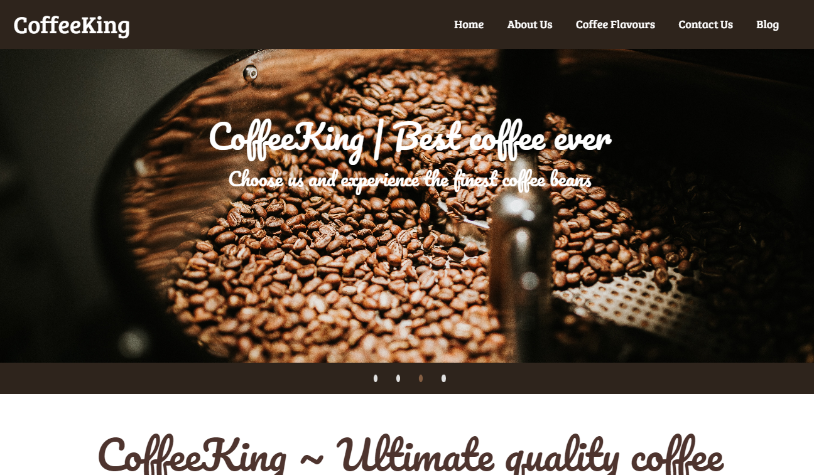

# Coffee House Landing Page 

### Project Thumbnail

***
### Project details
This project is a landing page of a coffee retail outlet. It is a purely responsive design , created for Desktop , mobile , and tablet usage. Only UI is developed for this project for this project, functionality is not.  
 Screen sizes
- Mobile(425px)
- Tablet(768px)
- Laptop(Full width)
- In general all screens

**It is coded using Materialize CSS** 

***
### Other Important Details
- >Time taken for completion : 3 hours
- Technologies Used
  - HTML
  - CSS
  - Materialize CSS
  - JS
  - Jquery
- VSCode for coding
- Figma
- Personal Learnings in this project 
    - HTML
    - CSS 
    - Materialize CSS
    - JS
    - Jquery
- Deployed on *Netlify*  **[ClickMe](https://coffee-king.netlify.app/)** 
*** 
#### About Author

- ~ Pritam Pal ~
- Profession - Full Stack Developer
- Contact Email - pal.pritam1416131@gmail.com
- [Personal Website](#)
- [LinkedIn](https://www.linkedin.com/in/pritampal1/)  

